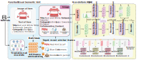

# CARD: Non-Uniform Quantization of Visual Semantic Unit for Generative Recommendation
# Framework

## 🛠️ Environment
python==3.8.13  
torch==2.0.0  
torchvision==0.15.1  
torchaudio==2.0.1  
transformers==4.46.2 
accelerate==0.8.0 

## 📦 Dataset 
We use the Amazon Reviews 2014 dataset. You may download it from the [Amazon 2014 Dataset Page](https://amazon-reviews-2024.s3.amazonaws.com/index.html).
```
cd process_data
```

### 📁 Processes the raw dataset.
```
python process_data.py
```

### Constructs interaction sequences for SASRec.
```
python process_collaborative_data.py
```
Then the SASRec model is employed to capture sequential user behaviors and derive product embeddings.

### ▶️ Construct Visual-Semantic Units.
```
python compose_card.py
```

### ⚙️ Encodes visual semantic units.
```
python encoder_card.py
```

## 🚀 Training Pipeline
train the NU-RQ-VAE
```
cd nu-rq-vae
python main.py
python generate_code.py
```

train the model
```
cd model
python main.py
```


